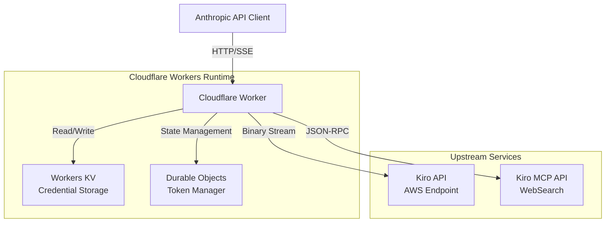
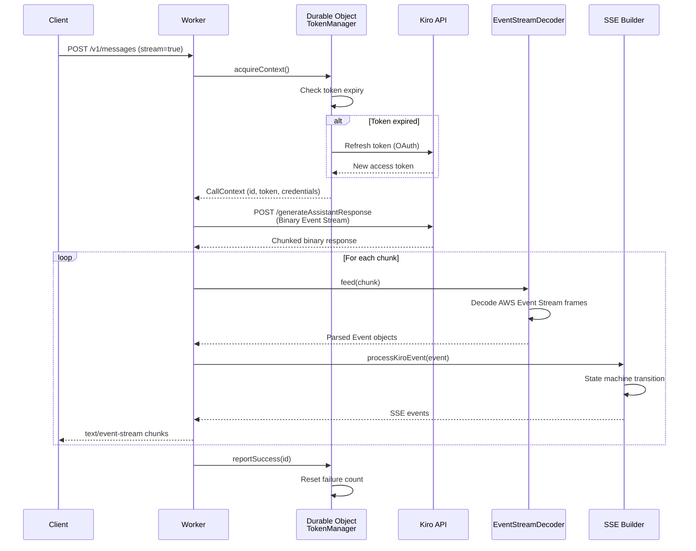

# Design Document: Cloudflare Workers Migration for kiro-rs

## Overview

This document outlines the technical design for migrating the kiro-rs Anthropic Claude API proxy from Rust to Cloudflare Workers using TypeScript. The project will rewrite all complex functionality including WebSearch MCP tool integration, streaming response handling with SSE, AWS Event Stream binary protocol parsing, token counting, Admin UI, and multi-credential management with automatic failover.

The migration aims to leverage Cloudflare Workers' global edge network for lower latency while maintaining full compatibility with the existing Anthropic API interface. Key challenges include adapting to Workers' runtime constraints (CPU time limits, memory limits, request size limits) while preserving all existing features including streaming responses, binary protocol parsing, and multi-credential failover logic.

## Architecture

### System Overview



### Request Flow Sequence



### Component Architecture

```mermaid
graph LR
    subgraph "API Layer"
        Router[Request Router]
        Auth[Auth Middleware]
        Models[GET /v1/models]
        Messages[POST /v1/messages]
        CountTokens[POST /v1/messages/count_tokens]
        AdminAPI[Admin API Endpoints]
    end
    
    subgraph "Business Logic"
        Converter[Request Converter<br/>Anthropic → Kiro]
        StreamHandler[Stream Handler]
        WebSearch[WebSearch Handler]
        TokenCounter[Token Counter]
    end
    
    subgraph "Protocol Layer"
        EventDecoder[AWS Event Stream Decoder]
        SSEBuilder[SSE Event Builder]
        ThinkingProcessor[Thinking Block Processor]
        ToolUseHandler[Tool Use Handler]
    end
    
    subgraph "Infrastructure"
        TokenManager[Token Manager<br/>Durable Object]
        CredentialStore[Credential Store<br/>Workers KV]
        HTTPClient[HTTP Client<br/>fetch API]
    end
    
    Router --> Auth
    Auth --> Models
    Auth --> Messages
    Auth --> CountTokens
    Auth --> AdminAPI
    
    Messages --> Converter
    Messages --> WebSearch
    Converter --> StreamHandler
    StreamHandler --> EventDecoder
    EventDecoder --> SSEBuilder
    SSEBuilder --> ThinkingProcessor
    SSEBuilder --> ToolUseHandler
    
    StreamHandler --> TokenManager
    WebSearch --> TokenManager
    TokenManager --> CredentialStore
    TokenManager --> HTTPClient
